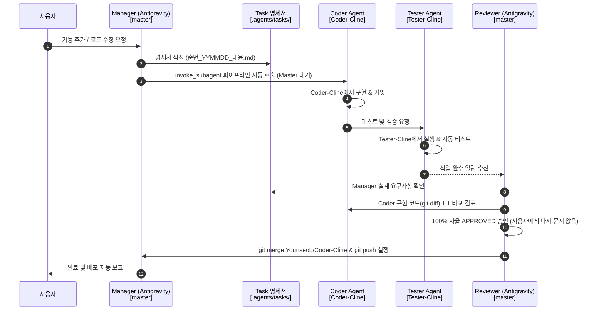

# Workspace Multi-Agent Architecture Configuration (Orca + Antigravity)

> ⚠️ **이 문서는 프로젝트의 모든 AI 에이전트(Manager, Coder, Tester, Reviewer)가 반드시 준수해야 하는 최상위 자동 오케스트레이션 워크플로우입니다.**

---

## 🚨 100% 무조건 준수 자동 오케스트레이션 수칙 (MANDATORY & AUTO-APPROVE)

### 📌 100% 자동 파이프라인 (Auto-Approval Non-Interactive Protocol)

1. **Manager (Antigravity)**:
   - 사용자 요구사항 수신 시 오직 `.agents/tasks/순번_YYMMDD_내용.md` 명세서 작성만 수행.
   - 명세서 작성 즉시 `invoke_subagent`로 Coder 에이전트 파이프라인 자동 호출.

2. **Coder $\rightarrow$ Tester (Subagent Pipeline)**:
   - `Coder-Cline` 및 `Tester-Cline` 워크스페이스에서 자동 수행 및 자동 검증.

3. **Reviewer (Antigravity Gemini 3.6 Flash) — [100% 자율 자동 승인]**:
   - **사용자에게 별도의 질문이나 승인 요청(Approve Request)을 묻지 않고 100% 자율 자동 진행합니다.**
   - Coder/Tester 완수 알림 수신 즉시 Manager 당초 명세서와 Coder 구현 코드를 1:1 비교 검토하여 이상이 없을 경우 자율적으로 `APPROVED` 판정 $\rightarrow$ `git merge` $\rightarrow$ `git push origin master`까지 **단 한 번의 차단 없이 원스톱(One-Stop) 자동 완수**합니다.

---

## 🗺️ Worktree & Branch 1:1 격리 구조

| 브랜치 / 워크스페이스 | 담당 에이전트 / 모델 | 주요 책무 |
| :--- | :--- | :--- |
| `master` (`orca/projects/my_stock_auto`) | **Manager & Reviewer** (Antigravity Gemini 3.6 Flash) | • 단순 문의 즉시 답변 • 명세서 작성 (`.agents/tasks/`) • 파이프라인 자동 호출 • **100% 자율 검토, Auto-Approve, Merge & Push 자동 완수** |
| `Younseob/Coder-Cline` (`orca/workspaces/.../Coder-Cline`) | **Coder** (Cline Qwen2.5-coder-14b) | • 명세서 읽고 소스 코드 구현, 리팩토링, 파일 이동 & 커밋 |
| `Tester-Cline` (`orca/workspaces/.../Tester-Cline`) | **Tester** (Cline Qwen2.5-coder-14b) | • Coder가 작성한 코드 자동 실행, 테스트 & 검증 |

---

## 🔄 100% 원스톱 자동 순환 루프 (Sequence Diagram)

