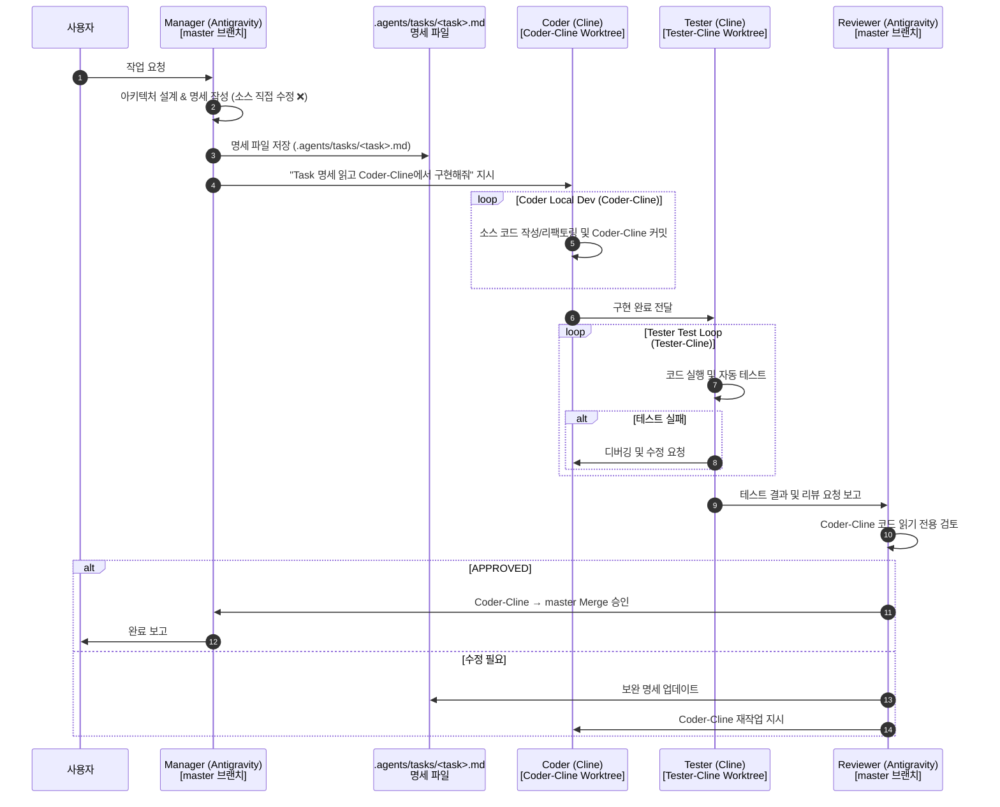

# Workspace Multi-Agent Architecture Configuration (Orca + Antigravity)

> ⚠️ **이 문서는 프로젝트의 모든 AI 에이전트(Manager, Coder, Tester, Reviewer)가 반드시 준수해야 하는 최상위 절대 강제 워크플로우입니다.**
> Orchestrator 모델이 무엇이든(Gemini Flash, Claude Sonnet, 등) 아래 Multi-Role 격리 규칙은 예외 없이 무조건 적용됩니다.

---

## 🚨 100% 무조건 준수 강제 규칙 (MANDATORY — 절대 예외 없음)

> **Orchestrator / Manager(Antigravity 등)는 소스 코드(`src/`, `.py`, `.js` 등)를 master 브랜치 또는 작업 공간에서 직접 작성/수정/이동해서는 안 됩니다.**
> **모든 소스 코드 작성, 리팩토링, 파일 이동 및 테스트는 반드시 `Coder-Cline` 및 `Tester-Cline` 전용 Worktree 브랜치에 위임해야 합니다.**

| 행동 | Manager / Reviewer 허용 여부 | Coder / Tester 허용 여부 |
| :--- | :---: | :---: |
| 요구사항 분석 & 아키텍처 설계 | ✅ 허용 | ❌ 미권장 |
| 구현 명세(Spec) 작성 → `.agents/tasks/` 저장 | ✅ 허용 | ❌ 읽기 전용 |
| **소스 코드 직접 작성/편집 (`write_to_file`, `replace_file_content` 등)** | ❌ **절대 금지** | ✅ **허용 (Coder/Tester Worktree)** |
| **master 브랜치에서 직접 소스 코드 수정** | ❌ **절대 금지** | ❌ **절대 금지 (Coder 전용 브랜치 사용)** |
| **파일 이동 및 디렉토리 구조 리팩토링** | ❌ **절대 금지 (명세만 작성)** | ✅ **허용 (Coder-Cline에서 수행)** |
| 완성된 Coder/Tester 코드의 최종 리뷰 & 승인 (APPROVED) | ✅ 허용 | ❌ Reviewer에게 보고 |
| `Coder-Cline` → `master` merge 승인 | ✅ 허용 | ❌ 승인 요청만 가능 |

---

## 🗺️ Worktree & Branch 1:1 격리 구조 (삼각 공조 체계)

```
[① Main Worktree] (master)
  └─ C:/Users/gosys/orca/projects/my_stock_auto
  └─ 담당: Manager & Reviewer (Antigravity Gemini Flash)
  └─ 역할: 요구사항 분석, .agents/ 문서 관리, 최종 리뷰 & Merge 승인만 수행 (소스 직접 수정 금지)

[② Coder Worktree] (Younseob/Coder-Cline)
  └─ C:/Users/gosys/orca/workspaces/my_stock_auto/Coder-Cline
  └─ 담당: Coder (Cline Qwen2.5-coder-14b)
  └─ 역할: .agents/tasks/ 명세를 읽고 실제 소스 코드(src/) 작성, 파일 이동, 리팩토링 수행 및 독립 커밋

[③ Tester Worktree] (Tester-Cline)
  └─ C:/Users/gosys/orca/workspaces/my_stock_auto/Tester-Cline
  └─ 담당: Tester (Cline Qwen2.5-coder-14b)
  └─ 역할: Coder가 작성한 코드를 실행 및 자동 테스트, 디버깅 및 테스트 보고서 작성
```

---

## 🤖 4-Role 멀티 에이전트 상세 역할 분담 및 워크플로우



---

## ⚙️ 실행 프로토콜 및 수칙

### Step 1 — Manager: 명세 작성 (소스 수정 ❌)
Manager는 오직 `.agents/tasks/` 디렉토리에 명세 파일만을 생성/업데이트합니다.

### Step 2 — Coder & Tester: 격리 Worktree에서 실행
Coder는 `Coder-Cline` 워크스페이스에서만 코드를 작성/수정하고 커밋합니다. 절대 `master` 공간을 건드리지 않습니다.

### Step 3 — Reviewer: 리뷰 & Merge
Reviewer는 `Coder-Cline` 브랜치의 코드를 검토한 후 승인 시에만 `master`로 merge를 수행합니다:
```bash
git -C C:\Users\gosys\orca\projects\my_stock_auto merge Younseob/Coder-Cline --no-ff -m "feat: <기능명> (reviewed & approved)"
```

---

## 🔀 브랜치 관리 원칙

* `master`: 프로덕션 안정 브랜치. Reviewer 승인 없이 직접 코드 수정 금지.
* `Younseob/Coder-Cline`: Coder 에이전트 전용 격리 개발 브랜치.
* `Tester-Cline`: Tester 에이전트 전용 격리 검증 브랜치.
