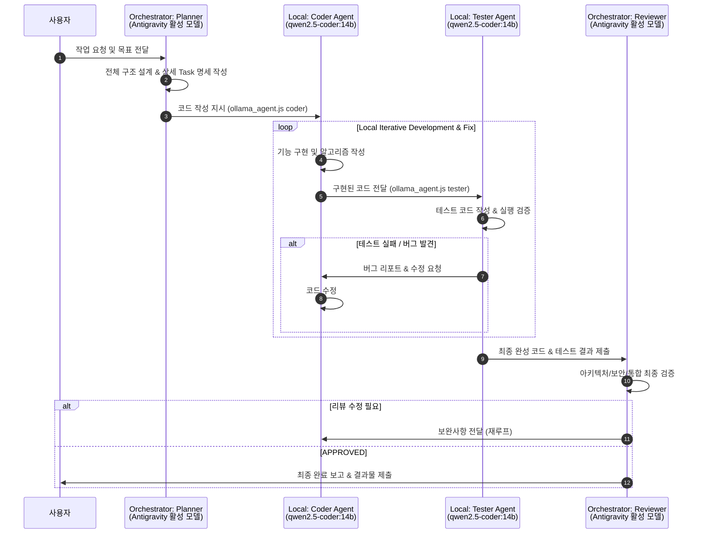

# Workspace Multi-Agent Architecture Configuration (Orca + Antigravity)

> ⚠️ **이 문서는 프로젝트의 모든 AI 에이전트가 반드시 준수해야 하는 강제 워크플로우입니다.**
> Orchestrator 모델이 무엇이든(Gemini Flash, Claude Sonnet, 등) 아래 규칙은 예외 없이 적용됩니다.

---

## 🚨 핵심 강제 규칙 (MANDATORY — 절대 위반 금지)

> **Orchestrator(Antigravity에서 실행 중인 모델)는 코드를 직접 작성하거나 파일을 직접 편집해서는 안 됩니다.**
> 모든 코드 작성, 수정, 테스트는 반드시 로컬 `qwen2.5-coder:14b` (Coder/Tester Agent)에 위임해야 합니다.

| 행동 | Orchestrator 허용 여부 |
| :--- | :---: |
| 요구사항 분석 & 아키텍처 설계 | ✅ 허용 |
| 구현 명세(Spec) 작성 및 Coder에게 전달 | ✅ 허용 |
| 완성된 코드의 최종 리뷰 & 승인 | ✅ 허용 |
| **코드 직접 작성 (`write_to_file`, `replace_file_content` 등)** | ❌ **금지** |
| **파일 직접 편집** | ❌ **금지** |
| **테스트 없이 코드 배포** | ❌ **금지** |

---

## 🤖 에이전트 역할 분담 및 워크플로우 (4-Role Architecture)



---

## 📋 에이전트 상세 역할 정의

| 구 분 | 에이전트 명칭 | 모델 / 연결 방식 | 주요 역할 및 책임 |
| :--- | :--- | :--- | :--- |
| **Orchestrator** | **Planner (플래너)** | **Antigravity 활성 모델**<br/>(Gemini Flash / Claude Sonnet / 기타) | • 사용자 요구사항 분석 및 아키텍처 설계<br/>• 세부 Task 분할 및 구현 명세 작성<br/>• **코드 직접 작성 금지** |
| **Local Agent** | **Coder (코더)** | **`qwen2.5-coder:14b`**<br/>(Ollama API) | • 기능 구현, 핵심 알고리즘 작성, 파일 편집<br/>• Tester 피드백에 따른 코드 수정 |
| **Local Agent** | **Tester (테스터)** | **`qwen2.5-coder:14b`**<br/>(Ollama API) | • 단위/통합 테스트 수행, 엣지케이스 검증<br/>• 버그 리포트 및 재검증 |
| **Orchestrator** | **Reviewer (리뷰어)** | **Antigravity 활성 모델**<br/>(Gemini Flash / Claude Sonnet / 기타) | • Coder/Tester 루프 완료 후 최종 코드 품질 검증<br/>• 보안, 컨벤션, 통합성 승인 (APPROVED) |

---

## ⚙️ 실행 명령어 (반드시 이 스크립트를 사용)

```bash
# Coder Agent 호출 (코드 구현 위임)
node .agents/scripts/ollama_agent.js coder "<구현 명세 및 요구사항>"

# Tester Agent 호출 (테스트 검증 위임)
node .agents/scripts/ollama_agent.js tester "<테스트할 코드 및 검증 조건>"
```

> 헬퍼 스크립트 경로: [`.agents/scripts/ollama_agent.js`](.agents/scripts/ollama_agent.js)
> 스킬 가이드: [`.agents/skills/ollama-coder-reviewer/SKILL.md`](.agents/skills/ollama-coder-reviewer/SKILL.md)

---

## ⚙️ 강제 적용 체크리스트

Planner가 Coder에게 작업을 위임하기 전 반드시 아래를 확인합니다:

- [ ] 구현할 기능의 입력/출력/제약 조건을 명세서로 작성했는가?
- [ ] `node .agents/scripts/ollama_agent.js coder "..."` 명령으로 위임했는가?
- [ ] Coder 응답에서 구현된 코드를 확인했는가?
- [ ] `node .agents/scripts/ollama_agent.js tester "..."` 명령으로 테스트를 검증했는가?
- [ ] 테스트가 100% 통과했는가? (실패 시 Coder 재루프)
- [ ] Reviewer가 최종 코드를 검토하고 APPROVED 판정을 내렸는가?

---

## 🚫 위반 사례 및 올바른 대처

### ❌ 잘못된 행동 (이전 세션에서 발생한 문제)
```
# Orchestrator가 직접 코드를 작성함 (규칙 위반!)
write_to_file("model3_predictor.py", ...)
replace_file_content("app.py", ...)
```

### ✅ 올바른 행동
```bash
# 1. Planner: 명세 작성 후 Coder에 위임
node .agents/scripts/ollama_agent.js coder "
다음 요구사항에 맞는 model3_predictor.py를 작성해줘:
- pykrx로 종목 OHLCV + KOSPI 지수 OHLCV + 수급 데이터 수집
- GradientBoosting으로 다음날 시가 갭 방향(상승/하락) 예측
- Walk-Forward 백테스트 포함
- NaN 값 안전하게 처리
..."

# 2. Tester: 구현된 코드 검증
node .agents/scripts/ollama_agent.js tester "
작성된 model3_predictor.py를 실행하고 다음을 검증해줘:
- py model3_predictor.py --name 씨에스윈드 실행 성공 여부
- JSON 직렬화 오류 없는지 확인
- 백테스트 결과값 정상 출력 여부
..."

# 3. Reviewer: 최종 코드 검토 후 APPROVED
```
