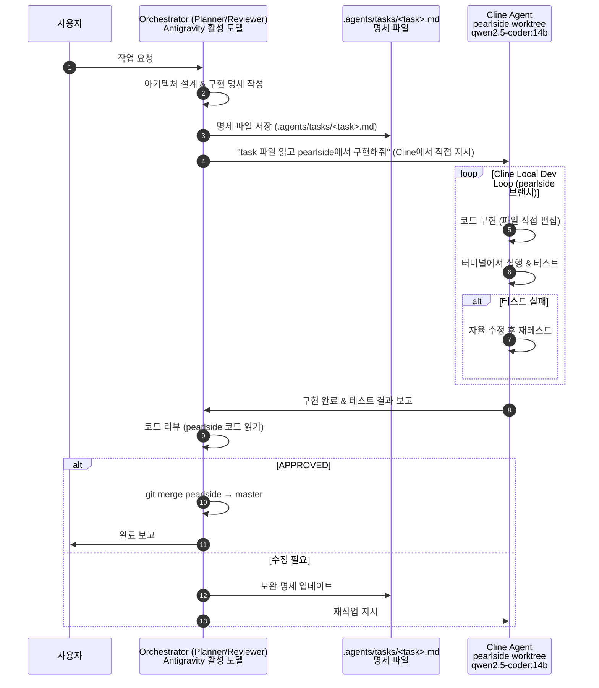

# Workspace Multi-Agent Architecture Configuration (Orca + Antigravity)

> ⚠️ **이 문서는 프로젝트의 모든 AI 에이전트가 반드시 준수해야 하는 강제 워크플로우입니다.**
> Orchestrator 모델이 무엇이든(Gemini Flash, Claude Sonnet, 등) 아래 규칙은 예외 없이 적용됩니다.

---

## 🚨 핵심 강제 규칙 (MANDATORY — 절대 위반 금지)

> **Orchestrator(Antigravity에서 실행 중인 모델)는 코드를 직접 작성하거나 파일을 직접 편집해서는 안 됩니다.**
> 모든 코드 작성, 수정, 테스트는 반드시 **Cline Agent (pearlside worktree)** 에 위임해야 합니다.

| 행동 | Orchestrator 허용 여부 |
| :--- | :---: |
| 요구사항 분석 & 아키텍처 설계 | ✅ 허용 |
| 구현 명세(Spec) 작성 → `.agents/tasks/` 파일로 저장 | ✅ 허용 |
| 완성된 코드의 최종 리뷰 & 승인 (APPROVED) | ✅ 허용 |
| pearlside → master merge 승인 | ✅ 허용 |
| **코드 직접 작성 (`write_to_file`, `replace_file_content` 등)** | ❌ **금지** |
| **파일 직접 편집** | ❌ **금지** |
| **Cline 없이 코드 배포** | ❌ **금지** |

---

## 🗺️ Worktree 구조

```
C:/Users/gosys/orca/projects/my_stock_auto/          ← main worktree (master)
                                                         Orchestrator가 읽기 전용으로 참조
C:/Users/gosys/orca/workspaces/my_stock_auto/pearlside/  ← Cline worktree (pearlside branch)
                                                             Cline이 실제 코드 작성/수정하는 공간
```

- **master** : 최종 승인된 안정 코드 (Orchestrator Reviewer가 APPROVED한 코드만 merge)
- **pearlside** : Cline이 작업하는 격리 공간. 실험/구현/테스트를 자유롭게 진행

---

## 🤖 에이전트 역할 분담 및 워크플로우 (4-Role Architecture)



---

## 📋 에이전트 상세 역할 정의

| 구 분 | 에이전트 명칭 | 모델 / 환경 | 주요 역할 및 책임 |
| :--- | :--- | :--- | :--- |
| **Orchestrator** | **Planner** | Antigravity 활성 모델<br/>(Gemini / Claude / 기타) | • 요구사항 분석 & 아키텍처 설계<br/>• `.agents/tasks/` 에 구현 명세 작성<br/>• **코드 직접 작성 금지** |
| **Local Agent** | **Cline Coder+Tester** | `qwen2.5-coder:14b`<br/>Cline (pearlside worktree) | • pearlside에서 파일 직접 편집<br/>• 터미널 실행 & 자율 테스트/수정<br/>• 완료 후 Orchestrator에 보고 |
| **Orchestrator** | **Reviewer** | Antigravity 활성 모델<br/>(Gemini / Claude / 기타) | • pearlside 코드 최종 검토<br/>• APPROVED 시 master merge<br/>• 수정 필요 시 태스크 업데이트 |

---

## ⚙️ 실행 프로토콜

### Step 1 — Orchestrator: 구현 명세 작성

```bash
# .agents/tasks/ 디렉토리에 명세 파일 생성 (Orchestrator가 작성)
# 예: .agents/tasks/feat_model4_volume_analysis.md
```

명세 파일 포맷 → `.agents/tasks/TASK_TEMPLATE.md` 참고

### Step 2 — Cline에서 태스크 실행

Cline VSCode 확장에서 직접:
```
"pearlside worktree 경로: C:\Users\gosys\orca\workspaces\my_stock_auto\pearlside
.agents/tasks/<task명>.md 파일을 읽고 명세에 따라 구현해줘.
구현 완료 후 py <파일>.py 실행해서 테스트 결과를 알려줘."
```

### Step 3 — Orchestrator: 리뷰 & Merge

```bash
# Cline이 완료 보고 후 Orchestrator가 코드 검토
# APPROVED 시 master에 merge
git -C C:\Users\gosys\orca\projects\my_stock_auto merge pearlside --no-ff -m "feat: <기능명> (reviewed & approved)"
```

---

## 📁 태스크 파일 컨벤션

위치: `.agents/tasks/<task_name>.md`

```markdown
# Task: <기능명>

## 목표
<무엇을 구현하는가>

## 대상 파일
- `pearlside/<파일명>.py` (신규 생성 or 수정)

## 구현 명세
### 입력
<입력값, 파라미터>

### 출력
<출력값, 반환 형식>

### 핵심 로직
<알고리즘, 라이브러리, 주요 처리 단계>

### 제약 조건
<성능, 예외처리, 의존성>

## 테스트 조건
- [ ] <테스트 명령 및 통과 기준 1>
- [ ] <테스트 명령 및 통과 기준 2>

## 완료 기준
모든 테스트 통과 후 Orchestrator Reviewer에게 결과 보고
```

---

## 🔀 Git 브랜치 전략

```
master  ←──── merge (APPROVED 후만)
   │
pearlside  ←── Cline이 작업 (자유롭게 커밋)
```

- Cline은 pearlside에서 자유롭게 커밋
- Orchestrator가 APPROVED하면 master로 merge
- 실패한 실험 코드는 pearlside에만 남고 master에 영향 없음
