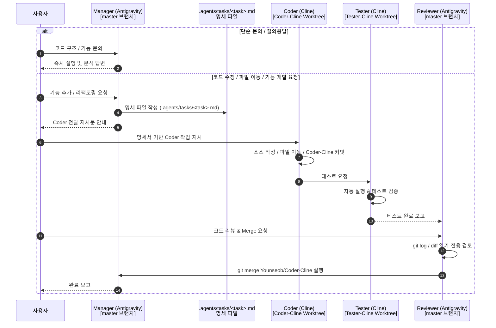

# Workspace Multi-Agent Architecture Configuration (Orca + Antigravity)

> ⚠️ **이 문서는 프로젝트의 모든 AI 에이전트(Manager, Coder, Tester, Reviewer)가 반드시 준수해야 하는 최상위 절대 강제 워크플로우입니다.**
> Orchestrator 모델이 무엇이든(Gemini Flash, Claude Sonnet, 등) 아래 Multi-Role 격리 규칙은 예외 없이 무조건 적용됩니다.

---

## 🚨 100% 무조건 준수 강제 규칙 (MANDATORY — 절대 예외 없음)

### 📌 Master(Manager) 세션 처리 분기 규칙

1. **단순 문의 / 질문 / 구조 설명 요청인 경우**:
   - `master` 세션(Antigravity)에서 코드 분석, 조회 및 답변을 직접 수행합니다.
   - 예: *"이 함수의 역할이 뭐야?"*, *"현재 디렉토리 구조 설명해줘"*, *"설정 확인해줘"*

2. **소스 코드 수정 / 파일 이동 / 기능 추가 / 리팩토링 요청인 경우**:
   - **`master` 세션에서 절대로 소스 코드를 직접 수정, 이동, 작성하지 않습니다 (`write_to_file` 소스 금지).**
   - **반드시 `Manager`가 `.agents/tasks/<task>.md` 명세서 작성 $\rightarrow$ `Coder` 구현 $\rightarrow$ `Tester` 검증 $\rightarrow$ `Reviewer` 승인 & Merge 루프를 사용하여 진행합니다.**

---

## 🗺️ Worktree & Branch 1:1 격리 구조 (삼각 공조 체계)

```
[① Main Worktree] (master)
  └─ C:/Users/gosys/orca/projects/my_stock_auto
  └─ 담당: Manager & Reviewer (Antigravity Gemini Flash / Gemini 3.6 Flash)
  └─ 역할: 단순 문의 답변, 아키텍처 설계, .agents/ 명세 관리, 최종 리뷰 & Merge 승인 (소스 직접 수정 금지)

[② Coder Worktree] (Younseob/Coder-Cline)
  └─ C:/Users/gosys/orca/workspaces/my_stock_auto/Coder-Cline
  └─ 담당: Coder (Cline Qwen2.5-coder-14b)
  └─ 역할: .agents/tasks/ 명세를 읽고 실제 소스 코드(src/) 작성, 파일 이동, 리팩토링 수행 및 독립 커밋

[③ Tester Worktree] (Tester-Cline)
  └─ C:/Users/gosys/orca/workspaces/my_stock_auto/Tester-Cline
  └─ 담당: Tester (Cline Qwen2.5-coder-14b)
  └─ 역할: Coder가 작성한 코드를 실행 및 자동 테스트, 디버깅 및 테스트 보고서 작성
```

---

## 🔄 Coder $\rightarrow$ Tester $\rightarrow$ Reviewer 표준 작업 루프



---

## ⚙️ 행동 수칙 요약

| 사용자 요청 종류 | Master(Manager) 처리 행동 | Coder / Tester / Reviewer 루프 |
| :--- | :--- | :--- |
| **단순 문의 / 질문** | 직접 파일 조회 후 답변 | 미사용 |
| **코드 수정 / 파일 이동 / 기능 추가** | 오직 `.agents/tasks/` 명세 작성만 수행 | **`Coder` $\rightarrow$ `Tester` $\rightarrow$ `Reviewer` (Merge) 필수 사용** |
