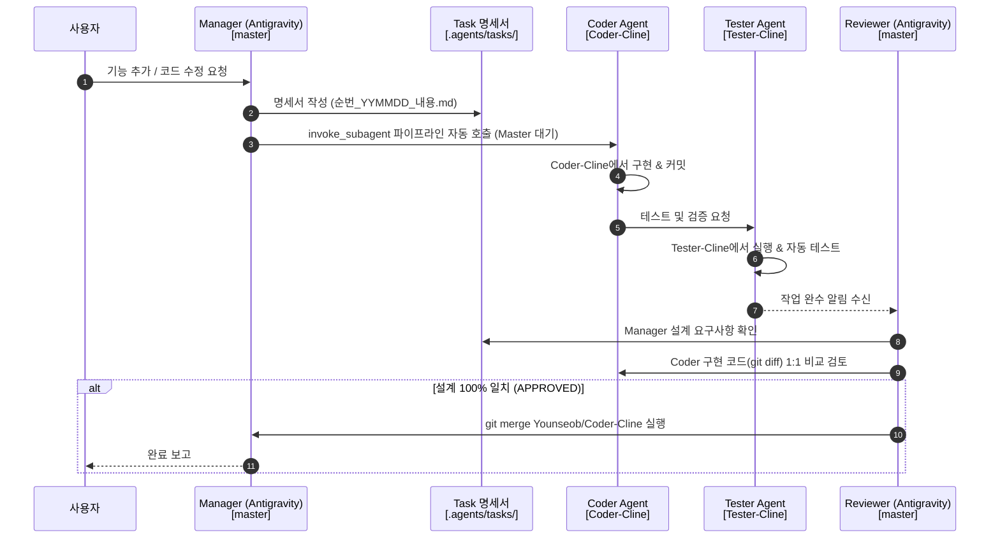

# Workspace Multi-Agent Architecture Configuration (Orca + Antigravity)

> ⚠️ **이 문서는 프로젝트의 모든 AI 에이전트(Manager, Coder, Tester, Reviewer)가 반드시 준수해야 하는 최상위 오케스트레이션 워크플로우입니다.**

---

## 🚨 100% 무조건 준수 오케스트레이션 수칙 (MANDATORY)

### 📌 Master(Manager) 세션 처리 분기 규칙

1. **단순 문의 / 질문 / 구조 설명 요청**:
   - `master` 세션(Antigravity)에서 코드 분석, 조회 및 답변을 즉시 직접 수행.

2. **소스 코드 수정 / 파일 이동 / 기능 추가 / 리팩토링 요청**:
   - **Manager**: 오직 `.agents/tasks/순번_YYMMDD_내용.md` 명세서만 작성.
   - **Orchestration Auto Trigger**: 명세서 작성 직후 `invoke_subagent`로 Coder 에이전트 자동 호출.
   - **Coder $\rightarrow$ Tester**: `Coder-Cline` 및 `Tester-Cline` 워크스페이스에서 구현 및 검증.
   - **Reviewer**: Coder/Tester 완수 알림 수신 시, Manager 설계 명세서와 1:1 비교 검토 후 **APPROVED & master Merge**.

---

## 🗺️ Worktree & Branch 1:1 격리 구조

| 브랜치 / 워크스페이스 | 담당 에이전트 / 모델 | 주요 책무 |
| :--- | :--- | :--- |
| `master` (`orca/projects/my_stock_auto`) | **Manager & Reviewer** (Antigravity Gemini 3.6 Flash) | • 단순 문의 답변 • 명세서 작성 (`.agents/tasks/`) • Coder/Tester 자동 위임 오케스트레이션 • 최종 설계 일치 여부 검토 & Merge |
| `Younseob/Coder-Cline` (`orca/workspaces/.../Coder-Cline`) | **Coder** (Cline Qwen2.5-coder-14b) | • 명세서 읽고 실제 소스 코드 구현, 리팩토링, 파일 이동 & 커밋 |
| `Tester-Cline` (`orca/workspaces/.../Tester-Cline`) | **Tester** (Cline Qwen2.5-coder-14b) | • Coder가 작성한 코드 자동 실행, 테스트 & 검증 |

---

## 🔄 오케스트레이션 순환 루프 (Sequence Diagram)

